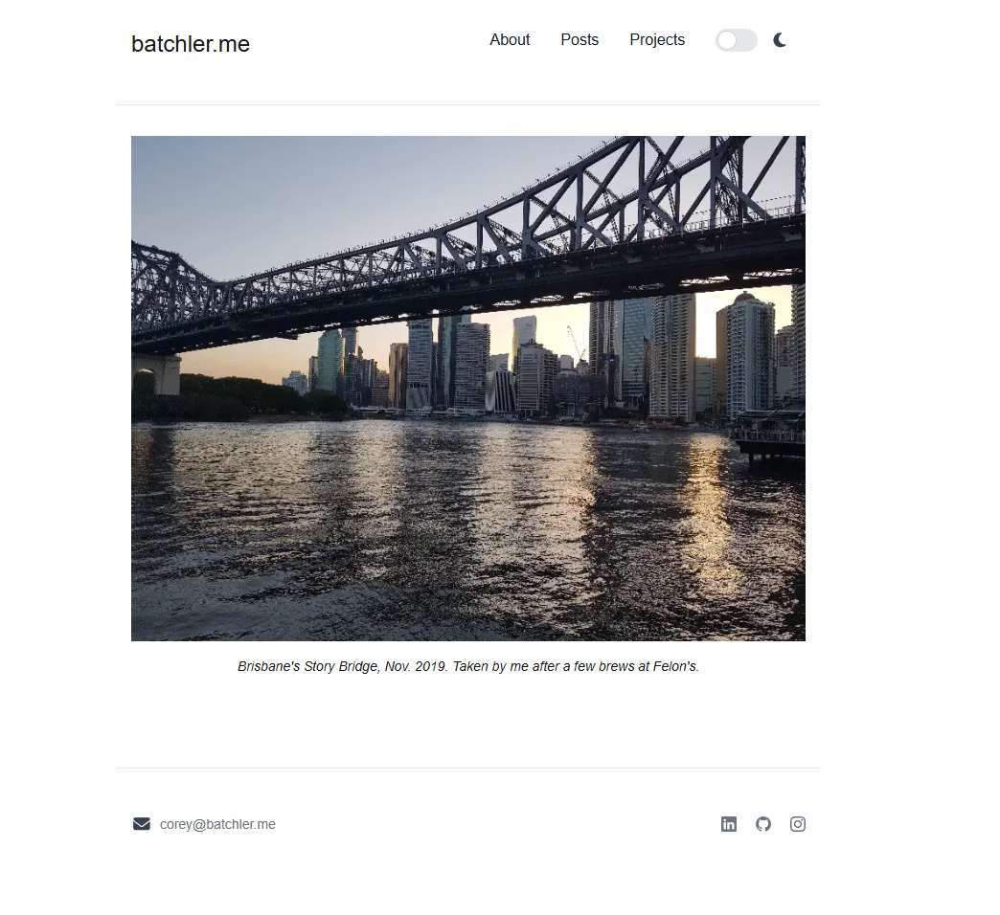

# batchler.me

This is my personal portfolio and blogging site where I occasionally make posts about the things that currently interest me.

[https://batchler.me](https://batchler.me)



## Running the site locally

This is a [Next.js](https://nextjs.org) project bootstrapped with [`create-next-app`](https://nextjs.org/docs/app/api-reference/cli/create-next-app).

First, run the development server:

```bash
npm run dev
```

Open [http://localhost:3000](http://localhost:3000) with your browser to see the result.
